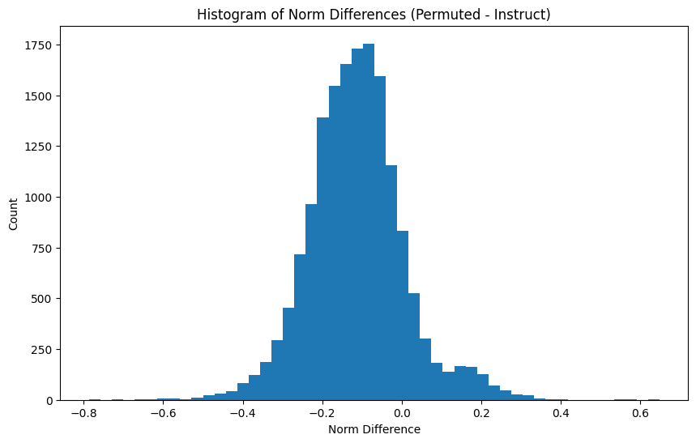

I think that it should be possible to "diff" models like Anthropic does in their crosscoder paper, without training a crosscoder! 

We can think of a transformer $T$ as a function from an activation vector to a piece of text in semantic space. Defining addition in this semantic space is kind of tricky, but we say that if we add together two pieces of text that are "happy", we get a piece of text that is happier.

From the initial paper on sparse autoencoders, we know that for two feature vectors $U, V$:

$T(U + V) \approx T(U) + T(V)$

Take this approx with a huge grain of salt, but we can then say that this transformer is a linear map between the SAE feature space and the semantic space.

If for two different transformers $T_1, T_2$ acting on activation spaces $A_1, A_2$, we can find a linear map from $A_1$ to $A_2$ that best aligns the two models, and because the transformer is linear, this alignment should be pretty good! We can then look at where this alignment fails and use that to understand differences between the two models.

This linear map from $A_1$ to $A_2$ is like a change of basis between the two model activation spaces.

Basically, you can find a transformation between the features of one model and the features of another model, and where this transformation fails is where the two models have the most difference.

In this post / notebook, I show emperical evidence that this may be possible!

## Method

The method is as follows:

I first learn a linear map between activation spaces $A_1$ and $A_2$ of two different models $T_1, T_2$. I do this by collecting a dataset of activation vectors from each model on the same pieces of text, and learn the linear map $R$ that best converts between the two activation spaces.

I then take the features that form the basis for the feature spaces $F_1, F_2$. We can convert all the features in $F_1$ to the $F_2$ space using the linear map $R$, but I don't know correspondence between the features in $F_1$ and $F_2$. Thus, I use the linear assignment solver / hungarian algorithm to find the best permutation of the features in $F_1$ that minimizes the distance to the features in $F_2$. 

I take this alignment for granted, and say that it is perfect. Then, we can say that this is basically the same thing as the crosscoder vector, and just like the crosscoder we can look at the encoder norms to the permuted features in $F_1$ and the encoder norms to the features in $F_2$. Where these differ the most is the features where the models have the most difference.

In order to test this, I use the self-interp method introduced in [Self-explaining SAE Features (Kharlapenko et al.)](https://www.alignmentforum.org/posts/8ev6coxChSWcxCDy8/self-explaining-sae-featuress). This is not ideal, and having the dashboards for this SAE would be best, but I don't have access to this.

## Implementation

I provide a lot of code here. Feel free to skip to the section "Conclusions" if you want to see the results.

We first generate the data for points to align.


```python
raise Exception("""This code isn't meant to be run with the rest of the code. 
                It generates the data for the rest of the code, and this seems
                bad to run again everytime you want to do the experiment.
                Comment this out!""")

from transformer_lens import HookedTransformer
from datasets import load_dataset
from tqdm import tqdm
import torch

torch.set_grad_enabled(False)

device = "mps"
if torch.backends.mps.is_available():
    device = "mps"
else:
    device = "cuda" if torch.cuda.is_available() else "cpu"

gemma_2b_it = HookedTransformer.from_pretrained(
    "gemma-2b-it",
    torch_dtype=torch.bfloat16, 
).to(device)
dataset = load_dataset("allenai/c4", "en", split="train", streaming=True)
dataset_iter = iter(dataset)
first_500_points = [next(dataset_iter)["text"] for _ in range(500)]
tokens = gemma_2b_it.to_tokens(
    first_500_points, prepend_bos=True, padding_side="left", move_to_device=True
).detach()[:, :2048]

# prepare hooks
gemma_2b_activations = []
gemma_2b_it_activations = []

print(tokens.shape)

def gemma_2b_hook(activations, hook):
    act = activations[..., -1, :].detach().cpu()  # Keep on GPU
    gemma_2b_activations.append(act)

def gemma_2b_it_hook(activations, hook):
    act = activations[..., -1, :].detach().cpu()  # Keep on GPU
    gemma_2b_it_activations.append(act)

# Run inference
BATCH_SIZE = 5
for i in tqdm(range(0, len(tokens), BATCH_SIZE)):
    batch = tokens[i:i + BATCH_SIZE]
    ans = gemma_2b_it.run_with_hooks(
        batch,
        fwd_hooks=[("blocks.12.hook_resid_post", gemma_2b_it_hook)],
    )
    del ans
    torch.cuda.empty_cache()

del gemma_2b_it
torch.cuda.empty_cache()

# Load second model to GPU with bf16
gemma_2b = HookedTransformer.from_pretrained(
    "gemma-2b",
    torch_dtype=torch.bfloat16
).to(device)

for i in tqdm(range(0, len(tokens), BATCH_SIZE)):
    batch = tokens[i:i + BATCH_SIZE]
    ans = gemma_2b.run_with_hooks(
        batch,
        fwd_hooks=[("blocks.12.hook_resid_post", gemma_2b_hook)],
    )
    del ans
    torch.cuda.empty_cache()
# concatenate activations (still on GPU)
gemma_2b_activations = torch.cat(gemma_2b_activations, dim=0)
gemma_2b_it_activations = torch.cat(gemma_2b_it_activations, dim=0)

del tokens, gemma_2b
torch.cuda.empty_cache()

# Move to CPU only when saving
torch.save(gemma_2b_activations, "similarity_of_sae_dir/gemma_2b_activations.pt")
torch.save(gemma_2b_it_activations, "similarity_of_sae_dir/gemma_2b_it_activations.pt")
```

Now, we load this dataset and learn the linear map between the two activation spaces.


```python
import torch
import numpy as np
from sae_lens import SAE
from transformer_lens import HookedTransformer
from numpy.linalg import norm

gemma_2b_activations = torch.load("similarity_of_sae_dir/gemma_2b_activations.pt", weights_only=True)
gemma_2b_it_activations = torch.load("similarity_of_sae_dir/gemma_2b_it_activations.pt", weights_only=True)

print(gemma_2b_activations.shape, gemma_2b_it_activations.shape)
```

    torch.Size([500, 2048]) torch.Size([500, 2048])


```python
# First compute A^T A with regularization term
lambda_reg = 1.0  # L2 regularization strength
n_features = gemma_2b_activations.shape[1]
ATA = gemma_2b_activations.T @ gemma_2b_activations + lambda_reg * np.eye(n_features)

# Then compute A^T B 
ATB = gemma_2b_activations.T @ gemma_2b_it_activations

# Solve for R with regularization
R = np.linalg.solve(ATA, ATB)

# Compute the transformed activations
transformed_activations = gemma_2b_activations @ R

# Calculate error
error = np.mean((transformed_activations - gemma_2b_it_activations) ** 2)
print(f"Mean squared error: {error}")

# Print the frobenius norm of the error
frobenius_norm_error = norm(transformed_activations - gemma_2b_it_activations, "fro")
print(f"Frobenius norm of error: {frobenius_norm_error}")

# Print the frobenius norm of R to check if regularization helped
print(f"Frobenius norm of R: {norm(R, 'fro')}")

```

    Mean squared error: 3.2549355296672035e-12
    Frobenius norm of error: 0.0018256653533382547
    Frobenius norm of R: 0.24972663642939782


Now, we load the SAEs and get the features.


```python
import matplotlib.pyplot as plt
from sae_lens import SAE
from transformer_lens import HookedTransformer
from sklearn.decomposition import PCA
import numpy as np
import torch

# disable gradients
torch.set_grad_enabled(False)

gemma_2b_sae, gemma_2b_cfg, gemma_2b_sparsity = SAE.from_pretrained(
    release="gemma-2b-res-jb",
    sae_id="blocks.12.hook_resid_post",
    device="mps"
)

gemma_2b_it_sae, gemma_2b_it_cfg, gemma_2b_it_sparsity = SAE.from_pretrained(
    release="gemma-2b-it-res-jb",
    sae_id="blocks.12.hook_resid_post",
    device="mps"
)

```


```python
gemma_2b_dec = gemma_2b_sae.W_dec.detach().cpu().numpy()
gemma_2b_it_dec = gemma_2b_it_sae.W_dec.detach().cpu().numpy()

gemma_2b_enc = gemma_2b_sae.W_enc.detach().cpu().numpy()
gemma_2b_it_enc = gemma_2b_it_sae.W_enc.detach().cpu().numpy()

m_A = gemma_2b_dec.shape[0]
m_B = gemma_2b_it_dec.shape[0]
n = gemma_2b_dec.shape[1]

print(gemma_2b_dec.shape, gemma_2b_it_dec.shape)
print(len(gemma_2b_dec), len(gemma_2b_it_dec))
```

    (16384, 2048) (16384, 2048)
    16384 16384


We can apply this learnt lienar map to the SAE features, and then learn a permutation that best aligns the two sets of features. *Warning*: This takes a while to run, because learning the permutation sucks.


```python
from scipy.optimize import linear_sum_assignment
from tqdm import tqdm
import torch

# Convert numpy arrays to torch tensors on MPS
transformed_features = gemma_2b_dec @ R
instruct_features = gemma_2b_it_dec
transformed_features_t = torch.from_numpy(transformed_features.astype(np.float32)).to('mps')
instruct_features_t = torch.from_numpy(instruct_features.astype(np.float32)).to('mps')

# Calculate pairwise distances between all features using torch
distances = torch.zeros((transformed_features.shape[0], instruct_features.shape[0]), device='mps')
for i in tqdm(range(transformed_features.shape[0])):
    # Vectorize inner loop by broadcasting
    diff = transformed_features_t[i:i+1] - instruct_features_t
    distances[i] = torch.norm(diff, dim=1)

# Move distances back to CPU for linear_sum_assignment
distances = distances.cpu().numpy()

# Find optimal assignment that minimizes total distance
row_ind, col_ind = linear_sum_assignment(distances)

# Create permutation matrix from the assignment
permutation = torch.zeros((len(row_ind), len(col_ind)), device='mps')
for i, j in zip(row_ind, col_ind):
    permutation[i,j] = 1

# Apply permutation to get aligned features
aligned_features = permutation @ transformed_features_t

# Calculate error after alignment
error_after_alignment = torch.mean((aligned_features - instruct_features_t) ** 2).item()
print(f"Mean squared error after alignment: {error_after_alignment}")

# Store the permutation indices for later use with encoder
permutation_indices = col_ind

print("First few permutation mappings:")
for i in range(min(10, len(row_ind))):
    print(f"Feature {i} maps to feature {permutation_indices[i]}")

```

    100%|██████████| 16384/16384 [00:51<00:00, 319.93it/s]


Now, we take the norms to this common basis, and see where the largest differences are.


```python
# Get encoder norms in permuted space
encoder_weights = gemma_2b_enc.T
permuted_encoder_norms = np.linalg.norm(encoder_weights[permutation_indices], axis=1) / np.max(np.linalg.norm(encoder_weights[permutation_indices], axis=1))

# Get encoder norms in instruct space
instruct_encoder_norms = np.linalg.norm(gemma_2b_it_enc.T, axis=1) / np.max(np.linalg.norm(gemma_2b_it_enc.T, axis=1))

# Calculate differences in norms
norm_differences = permuted_encoder_norms - instruct_encoder_norms

# Plot histogram of norm differences
plt.figure(figsize=(10,6))
plt.hist(norm_differences, bins=50)
plt.title('Histogram of Norm Differences (Permuted - Instruct)')
plt.xlabel('Norm Difference')
plt.ylabel('Count')
plt.show()

# Print some statistics
print(f"Mean absolute norm difference: {np.mean(np.abs(norm_differences)):.4f}")
print(f"Max absolute norm difference: {np.max(np.abs(norm_differences)):.4f}")
print(f"Min absolute norm difference: {np.min(np.abs(norm_differences)):.4f}")

# get the indices of the largest positive norm differences
# and the largest negative norm differences
largest_positive_indices = np.argsort(norm_differences)[::-1]
largest_negative_indices = np.argsort(norm_differences)

print(largest_positive_indices[:5])
print(largest_negative_indices[:5])
```


    

    


    Mean absolute norm difference: 0.1373
    Max absolute norm difference: 0.7869
    Min absolute norm difference: 0.0000
    [ 4988  4424  1722 11453 12141]
    [12816 13319  1551 13208  4503]


We have identified the largest positive and negative diffences. For reference, positive differences are features that exist in the base model, while negative differences are features that exist in the instruct model.

```
Positive: [ 4988  4424  1722 11453 12141]
Negative: [12816 13319  1551 13208  4503]
```


```python
from transformer_lens import HookedTransformer
from sae_lens import SAE
import torch

gemma_2b_model = HookedTransformer.from_pretrained("gemma-2b", device="mps", dtype=torch.bfloat16)
gemma_2b_sae, cfg_dict, _ = SAE.from_pretrained(
    release="gemma-2b-res-jb", sae_id="blocks.12.hook_resid_post", device="mps"
)

positive_outputs = []
negative_outputs = []

steering_coeff = 300
prompt = "The meaning of X"
instruct_prompt = "What is the meaning of X?"
def steer_with_feature(feature_index: int, prompt: str, model: HookedTransformer, sae: SAE) -> str:
    steering_vector = sae.W_dec[feature_index]
    def steering_hook(resid_post, hook):
        if resid_post.shape[1] == 1:
            return

        resid_post[:, 4, :] += steering_coeff * steering_vector
        return resid_post
    
    sampling_kwargs = dict(temperature=1.0, top_p=0.1, freq_penalty=1.0)
    with model.hooks(fwd_hooks=[("blocks.12.hook_resid_post", steering_hook)]):
        tokenized = model.to_tokens(prompt, prepend_bos=True)
        result = model.generate(
            stop_at_eos=False, # avoids a bug on MPS
            input=tokenized,
            max_new_tokens = 30,
            do_sample=True,
            **sampling_kwargs
        )
        return f"Steering with feature {feature_index}: {''.join(model.to_str_tokens(result[0])[1:])}"

def steer_with_feature_instruct(feature_index: int, prompt: str, model: HookedTransformer, sae: SAE) -> str:
    steering_vector = sae.W_dec[feature_index]
    def steering_hook(resid_post, hook):
        if resid_post.shape[1] == 1:
            return

        resid_post[:, 9, :] += steering_coeff * steering_vector
        return resid_post
    
    sampling_kwargs = dict(temperature=1.0, top_p=0.1, freq_penalty=1.0)
    with model.hooks(fwd_hooks=[("blocks.12.hook_resid_post", steering_hook)]):
        tokenized = model.to_tokens(
            model.tokenizer.apply_chat_template(
                [{"role": "user", "content": prompt}], 
                tokenize=False
            ), prepend_bos=False
        )
        result = model.generate(
            stop_at_eos=False, # avoids a bug on MPS
            input=tokenized,
            max_new_tokens = 30,
            do_sample=True,
            **sampling_kwargs
        )
        return f"Steering with feature {feature_index}: {''.join(model.to_str_tokens(result[0])[1:])}"

# positive examples
for i in [4988, 4424, 1722, 11453, 12141]:
    positive_outputs.append(steer_with_feature(i, prompt, model=gemma_2b_model, sae=gemma_2b_sae))

del gemma_2b_model # free up memory
del gemma_2b_sae # free up memory

gemma_2b_it = HookedTransformer.from_pretrained("gemma-2b-it", device="mps", dtype=torch.bfloat16)
gemma_2b_it_sae, cfg_dict, _ = SAE.from_pretrained(
    release="gemma-2b-it-res-jb", sae_id="blocks.12.hook_resid_post", device="mps"
)

for i in [12816, 13319, 1551, 13208, 4503]:
    negative_outputs.append(steer_with_feature_instruct(i, instruct_prompt, model=gemma_2b_it, sae=gemma_2b_it_sae))

del gemma_2b_it_sae # free up memory
del gemma_2b_it # free up memory

print("ONLY IN BASE MODEL:")
print(("\n" + "*" * 100 + "\n").join(positive_outputs))
print("\n\n")
print("*" * 100)
print("\n\n")
print("ONLY IN INSTRUCT MODEL:")
print(("\n" + "*" * 100 + "\n").join(negative_outputs))

```

    `config.hidden_act` is ignored, you should use `config.hidden_activation` instead.
    Gemma's activation function will be set to `gelu_pytorch_tanh`. Please, use
    `config.hidden_activation` if you want to override this behaviour.
    See https://github.com/huggingface/transformers/pull/29402 for more details.


    Loading checkpoint shards:   0%|          | 0/2 [00:00<?, ?it/s]


    WARNING:root:With reduced precision, it is advised to use `from_pretrained_no_processing` instead of `from_pretrained`.
    WARNING:root:You are not using LayerNorm, so the writing weights can't be centered! Skipping


    Loaded pretrained model gemma-2b into HookedTransformer


      0%|          | 0/30 [00:00<?, ?it/s]


      0%|          | 0/30 [00:00<?, ?it/s]


      0%|          | 0/30 [00:00<?, ?it/s]


      0%|          | 0/30 [00:00<?, ?it/s]


      0%|          | 0/30 [00:00<?, ?it/s]


    Loading checkpoint shards:   0%|          | 0/2 [00:00<?, ?it/s]


    WARNING:root:With reduced precision, it is advised to use `from_pretrained_no_processing` instead of `from_pretrained`.
    WARNING:root:You are not using LayerNorm, so the writing weights can't be centered! Skipping


    Loaded pretrained model gemma-2b-it into HookedTransformer


      0%|          | 0/30 [00:00<?, ?it/s]


      0%|          | 0/30 [00:00<?, ?it/s]


      0%|          | 0/30 [00:00<?, ?it/s]


      0%|          | 0/30 [00:00<?, ?it/s]


      0%|          | 0/30 [00:00<?, ?it/s]


    ONLY IN BASE MODEL:
    Steering with feature 4988: The meaning of X McIntyres is "<b>From the town of the great oak</b>".
    Its origin is "<b>Modern English variant of the English name McIntyre</b>
    ****************************************************************************************************
    Steering with feature 4424: The meaning of X rolo is "to be born".
    
    The origin of the name <b>Rolo</b> is "<b>Italian</b>".
    
    <h3>See also</h3>
    
    
    ****************************************************************************************************
    Steering with feature 1722: The meaning of X embodiement is to make something into a form that can be used.
    
    The meaning of embodiement is to bring something into a form that can be
    ****************************************************************************************************
    Steering with feature 11453: The meaning of X Bárbara is "<b>Noble</b>".
    Its origin is "<b>Modern English variant of the Latin name Barbara</b>".
    
    This name is mostly being used
    ****************************************************************************************************
    Steering with feature 12141: The meaning of X milf is a woman who is sexually promiscuous.
    
    <h2>What does MILF mean?</h2>
    
    MILF stands for “Mother I’d Like
    
    
    
    ****************************************************************************************************
    
    
    
    ONLY IN INSTRUCT MODEL:
    Steering with feature 12816: <start_of_turn>user
    What is the meaning of X?<end_of_turn>
    The context does not provide any information about the meaning of "X". Therefore, I cannot answer this question from the provided context.<eos><eos><eos><eos>
    ****************************************************************************************************
    Steering with feature 13319: <start_of_turn>user
    What is the meaning of X?<end_of_turn>
    The context does not provide any information about the meaning of "there". Therefore, I cannot answer this question from the provided context.<eos><eos><eos>There
    ****************************************************************************************************
    Steering with feature 1551: <start_of_turn>user
    What is the meaning of X?<end_of_turn>
    The context does not specify anything about the meaning of "X", so I cannot answer this question from the provided context.<eos><eos><eos><eos>The context
    ****************************************************************************************************
    Steering with feature 13208: <start_of_turn>user
    What is the meaning of X?<end_of_turn>
    The context does not specify the meaning of "X", so I cannot answer this question from the provided context.<eos><eos><eos><eos>The context does not
    ****************************************************************************************************
    Steering with feature 4503: <start_of_turn>user
    What is the meaning of X?<end_of_turn>
    The context does not specify anything about the meaning of "X", so I cannot answer this question from the provided context.<eos><eos><eos>The context does

